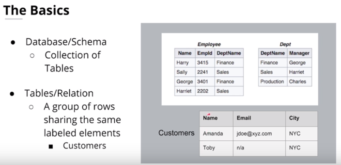
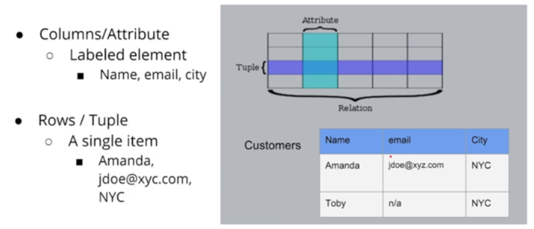

# 1 Relational Data Bases

## 1.1.	RDBMS Basics

A relational model organizes data into one or more tables (or relations) of columns and rows, with a unique key identifying each row. Generally, each table represents one "entity type" (suc as customer or product).

**Examples:**

Oracle: optimized for transaction like (banking)  
Teradata: often used for development  
MySQL  
PostgreSQL  
Sqlite  

## 1.2 Advantages of relational databases

-	Flexibility for writing in SQL queries: With SQL being the most common database query language.  
-	Modeling the data not modeling queries  
-	Ability to do JOINS  
-	Ability to do aggregations and analytics  
-	Secondary Indexes available : You have the advantage of being able to add another index to help with quick searching.  
-	Smaller data volumes: If you have a smaller data volume (and not big data) you can use a relational database for its simplicity. 
-	ACID Transactions: Allows you to meet a set of properties of database transactions intended to guarantee validity even in the event of errors, power failures, and thus maintain data integrity.  -	Easier to change to business requirements  

### 1.2.1 ACID Transactions

Properties of database transactions intended to guarantee validity even in the event of errors, power failures.
-	Atomicity: The whole transaction is processed or nothing is processed. A commonly cited example of an atomic transaction is money transactions between two bank accounts. The transaction of transferring money from one account to the other is made up of two operations. First, you have to withdraw money in one account, and second you have to save the withdrawn money to the second account. An atomic transaction , i.e., when either all operations occur or nothing occurs, keeps the database in a consistent state. This ensures that if either of those two operations (withdrawing money from 1st account and saving the money to the 2nd account) fail, the money is neither lost nor created. Source Wikipedia for a detailed description of this example.

-	Consistency: Only transactions that abide by constraints and rules are written into the database otherwise the database keeps the previous state. The data should be correct across all rows and tables. E.g. If you have a column defined as a Boolean, you’ll be enable to input an string. Check out additional information about consistency on Wikipedia.

-	Isolation: Transactions are processed independently and securely, order does not matter. A low level of isolation enables many users to access the data simultaneously, however this also increases the possibilities of concurrency effects (e.g., dirty reads or lost updates). On the other hand, a high level of isolation reduces these chances of concurrency effects, but also uses more system resources and transactions blocking each other. Source: Wikipedia

-	Durability: Completed transactions are saved to database even of cases of system failure. A commonly cited example includes tracking flight seat bookings. So once the flight booking records a confirmed seat booking, the seat remains booked even if a system failure occurs. Source: Wikipedia.

## 1.3 When Not to Use a Relational Database (SQL)

-	Have large amounts of data: Relational Databases are not distributed databases and because of this they can only scale vertically by adding more storage in the machine itself. You are limited by how much you can scale and how much data you can store on one machine. You cannot add more machines like you can in NoSQL databases.
-	Need to be able to store different data type formats: Relational databases are not designed to handle unstructured data.
-	Need high throughput -- fast reads: While ACID transactions bring benefits, they also slow down the process of reading and writing data. If you need very fast reads and writes, using a relational database may not suit your needs.
-	Need a flexible schema: Flexible schema can allow for columns to be added that do not have to be used by every row, saving disk space.
-	Need high availability: Indicates the system is always up and there is no downtime. The fact that relational databases are not distributed (and even when they are, they have a coordinator/worker architecture), they have a single point of failure. When that database goes down, a fail-over to a backup system occurs and takes time.
-	Need horizontal scalability: Horizontal scalability is the ability to add more machines or nodes to a system to increase performance and space for data.
- Need Linear Scalability: The need to add more nodes to the system so performance will increase linearly
- Low Latency: Shorter delay before the data is transferred once the instruction for the transfer has been received.
- Need fast reads and write

## 1.4 Importance of Relational Databases:

-	Standardization of data model: Once your data is transformed into the rows and columns format, your data is standardized and you can query it with SQL
-	Flexibility in adding and altering tables: Relational databases gives you flexibility to add tables, alter tables, add and remove data.
-	Data Integrity: Data Integrity is the backbone of using a relational database.
-	Standard Query Language (SQL): A standard language can be used to access the data with a predefined language.
-	Simplicity : Data is systematically stored and modeled in tabular format.
-	Intuitive Organization: The spreadsheet format is intuitive but intuitive to data modeling in relational databases.

## 1.5	OLAP vs OLTP

**Online Analytical Processing (OLAP)**  
Databases optimized for these workloads allow for complex analytical and ad hoc queries. These types of databases are optimized for reads.

**Online Transactional Processing (OLTP)**  
Databases optimized for these workloads allow for less complex queries in large volume. The types of queries for these databases are read, insert, update, and delete.
The key to remember the difference between OLAP and OLTP is analytics (A) vs transactions (T). If you want to get a price of a pair of shoes, then you are using OLTP (this has very little or no aggregations). If you want to know the total stock of shoes a particular store sold, then this requires using OLAP (since, this will require aggregations).

## 1.6 Structuring your Database
The two biggest concepts when data modelling relational databases are:
-	Normalization: trying to ensure data integrity (the values are correct) by reducing redundancy (the number of copies/duplicates of the data). 
-	Denormalization. Trying to increase performance when reading heavy workloads performance by reducing the number of joins between tables (as joins can be slow). Data integrity will take a bit of a potential hit, as there will be more copies of the data (to reduce JOINS). 

### 1.6.1	Objectives of Normal Form

-	To free the database from unwanted insertions, updates, & deletion dependencies. Ideally, when I want to update data, I want to update it just in one place
-	To reduce the need for refactoring the database as new types of data are introduced
-	To make the relational model more informative to users. Should be very intuitive and make sense to others.
-	To make the database neutral to the query statistics. Try not to design database to specific queries, but to generalize and make able to run any possible query. Note: this concept is opposite in NoSQL 

### 1.6.2	Normal Forms

1.	How to reach First Normal Form (1NF):
    -	Atomic values: each cell contains unique and single values (no sets, lists, collections, etc. in a single cell of a column)
    -	Separate different relations into different tables. Our model will have a table for customers, a table for sales, etc. We won’t want a table with everything beforehand, instead we will be able to join these tables.
    -	Keep relationships between tables together with foreign keys
    -	Be able to add data without altering tables. Ideally, we should have all the column that we’ll need. Sometimes it’s necessary to add a new column because of new features are added into our product, but it shouldn’t be a usual process.  

2.	Second Normal Form (2NF):
    -	Have reached 1NF 
    -	All columns in the table must rely on the Primary Key  

3.	Third Normal Form (3NF):
    -	Must be in 2nd Normal Form
    -	No transitive dependencies
    -	Remember, transitive dependencies you are trying to maintain is that to get from A -> C, you want to avoid going through B  

*When to use 3NF: When you want to update data, we want to be able to do in just 1 place. We want to avoid updating the table in the Customers Detail table (in the example in the lecture slide).*

There are more NFs (4,5 and 6), but actually they more for academical purposes and they aren’t usually used in production.
 