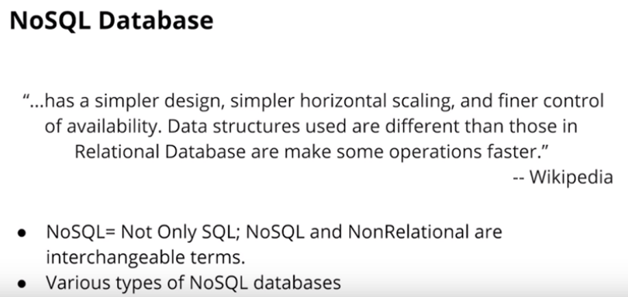
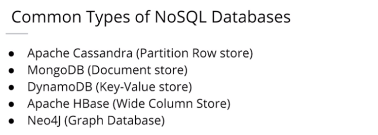
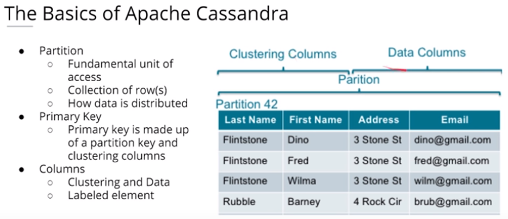
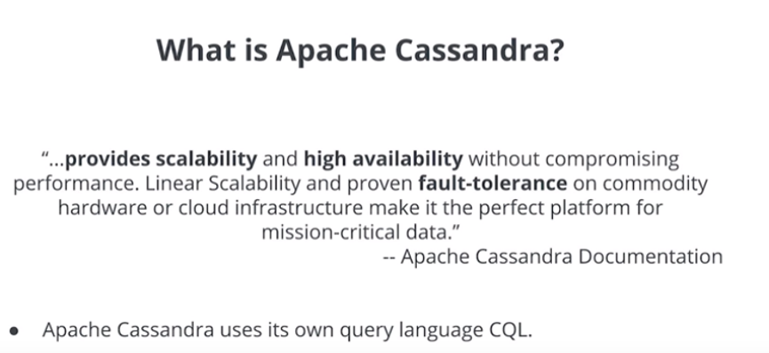

# 2 NoSQL Databases

 
## 2.1 Advantages and drawbacks

### When to use a NoSQL Database?

-	Need to be able to store different data type formats: NoSQL was also created to handle different data configurations: structured, semi-structured, and unstructured data. JSON, XML documents can all be handled easily with NoSQL.
-	Large amounts of data: Relational Databases are not distributed databases and because of this they can only scale vertically by adding more storage in the machine itself. NoSQL databases were created to be able to be horizontally scalable. The more servers/systems you add to the database the more data that can be hosted with high availability and low latency (fast reads and writes).
-	Need horizontal scalability: Horizontal scalability is the ability to add more machines or nodes to a system to increase performance and space for data
-	Need high throughput: While ACID transactions bring benefits they also slow down the process of reading and writing data. If you need very fast reads and writes using a relational database may not suit your needs.
-	Need a flexible schema: Flexible schema can allow for columns to be added that do not have to be used by every row, saving disk space.
-	Need high availability: Relational databases have a single point of failure. When that database goes down, a failover to a backup system must happen and takes time.

### When NOT to use a NoSQL Database?

-	When you have a small dataset: NoSQL databases were made for big datasets not small datasets and while it works it wasn’t created for that.
-	When you need ACID Transactions: If you need a consistent database with ACID transactions, then NoSQL databases will not be able to serve this need. NoSQL database are eventually consistent and do not provide ACID transactions.
-	When you need the ability to do JOINS across tables: NoSQL does not allow the ability to do JOINS. This is not allowed as this will result in a full table scans.
-	If you want to be able to do aggregations and analytics
-	If you have changing business requirements: Ad-hoc queries are possible but difficult as the data model was done to fix particular queries
-	If your queries are not available and you need the flexibility: You need your queries in advance. If those are not available or you will need to be able to have flexibility on how you query your data you might need to stick with a relational database

## 2.2 CAP Theorem

- **Consistency**: Every read from the database gets the latest (and correct) piece of data or an error
- **Availability**: Every request is received and a response is given, without a guarantee that the data is the latest update
- **Partition Tolerance**: The system continues to work regardless of losing network connectivity between nodes

## 2.2 Data Modeling in Apache Cassandra

## 2.2.1 Basics

- Apache Cassandra has been optimized for fast writes, so we must model our data well to allow read fast. 
- Denormalization is not just okay -- it's a must
- Denormalization must be done for fast reads
- ALWAYS think Queries first
- One table per query is a great strategy
- Apache Cassandra does NOT allow for JOINs between tables

## 2.2.2 Primary Keys

- Must be unique. If a duplicated value enter into the database, an error won't be thrown value will be overwritten.
- The PRIMARY KEY is made up of either just the PARTITION KEY or with the addition of CLUSTERING COLUMNS
- The **Partition Key** will determine the distribution of data across the system.
- A simple Primary Key is just one column that is also the Partition Key. A Composite PRIMARY KEY is made up of more than one column and will assist in creating a unique value and in your retrieval queries.
- The **Cluster Columns** will sort the data in sorted descending order.
- More than one clustering column can be added (or none!)
- From there the clustering columns will sort in order of how they were added to the primary key.
- Data Modeling in Apache Cassandra is query focused, and that focus needs to be on the WHERE clause
- Failure to include a WHERE clause will result in an error

### 2.2.3 Cassandra Data Modelling Process

1. Define a query
2. Think what could be a good partition i.e. the filter (where statement that your are going to use). This is going to be the Partition Key.
2. If this key don't ensure unique values in key, think which other keys are good to define a composite primary key. This added key columns will be Cluster Columns.

**Allow filtering**

https://www.datastax.com/dev/blog/allow-filtering-explained-2

Let’s take for example the following table:

CREATE TABLE blogs (blogId int, 
                    time1 int, 
                    time2 int, 
                    author text, 
                    content text, 
                    PRIMARY KEY(blogId, time1, time2));
If you execute the following query:

SELECT * FROM blogs;
Cassandra will return you all the data that the table blogs contains.

If you now want only the data at a specified time1, you will naturally add an equal condition on the column time1:

SELECT * FROM blogs WHERE time1 = 1418306451235;
In response, you will receive the following error message:

Bad Request: Cannot execute this query as it might involve data filtering and thus may have unpredictable performance. If you want to execute this query despite the performance unpredictability, use ALLOW FILTERING.
Cassandra knows that it might not be able to execute the query in an efficient way. It is therefore warning you: “Be careful. Executing this query as such might not be a good idea as it can use a lot of your computing resources”.

The only way Cassandra can execute this query is by retrieving all the rows from the table blogs and then by filtering out the ones which do not have the requested value for the time1 column.

If your table contains for example a 1 million rows and 95% of them have the requested value for the time1 column, the query will still be relatively efficient and you should use ALLOW FILTERING.

On the other hand, if your table contains 1 million rows and only 2 rows contain the requested value for the time1 column, your query is extremely inefficient. Cassandra will load 999, 998 rows for nothing. If the query is often used, it is probably better to add an index on the time1 column.

Unfortunately, Cassandra has no way to differentiate between the 2 cases above as they are depending on the data distribution of the table.  Cassandra is therefore warning you and relying on you to make the good choice.

Secondary indices and ALLOW FILTERING
If we add an index on the author column and execute the following query:

SELECT * FROM blogs WHERE author = ‘Jonathan Ellis’;
Cassandra will return all the blogs that have been written by Jonathan and will not request ALLOW FILTERING. This is due to the fact that Cassandra can use the secondary index on the author column to find the matching rows and does not need to perform any filtering.

But if we execute the following one:

SELECT * FROM blogs WHERE author=’Jonathan Ellis’ and time2 = 1418306451235;
Cassandra will request ALLOW FILTERING as it will have to first find and load the rows containing Jonathan as author, and then to filter out the ones which do not have a time2 column equal to the specified value.

Adding an index on time2 might improve the query performance. Cassandra will then use the index with the highest selectivity to find the rows that need to be loaded. It will however not change anything regarding the need for ALLOW FILTERING, as it will still have to filter the loaded rows using the remaining predicate.

Making the right choice
When your query is rejected by Cassandra because it needs filtering, you should resist the urge to just add ALLOW FILTERING to it. You should think about your data, your model and what you are trying to do.

You always have multiple options. You can change your data model, add an index, use another table or use ALLOW FILTERING.

You have to make the right choice for your specific use case.
