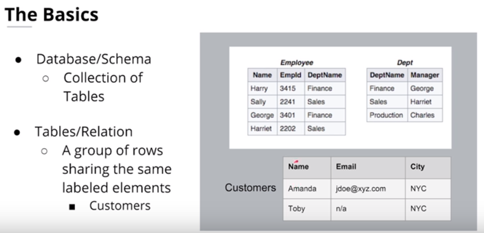
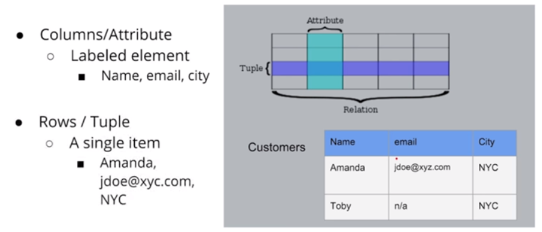
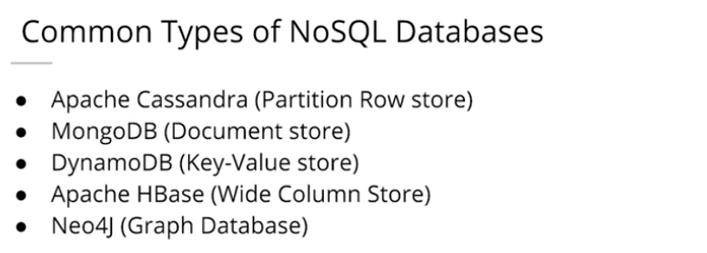

# 1 Relational Data Bases

## 1.1.	RDBMS Basics

A relational model organizes data into one or more tables (or relations) of columns and rows, with a unique key identifying each row. Generally, each table represents one "entity type" (suc as customer or product).

**Examples:**

Oracle: optimized for transaction like (banking)  
Teradata: often used for development  
MySQL  
PostgreSQL  
Sqlite  

## 1.2 Advantages of relational databases

-	Flexibility for writing in SQL queries: With SQL being the most common database query language.  
-	Modeling the data not modeling queries  
-	Ability to do JOINS  
-	Ability to do aggregations and analytics  
-	Secondary Indexes available : You have the advantage of being able to add another index to help with quick searching.  
-	Smaller data volumes: If you have a smaller data volume (and not big data) you can use a relational database for its simplicity. 
-	ACID Transactions: Allows you to meet a set of properties of database transactions intended to guarantee validity even in the event of errors, power failures, and thus maintain data integrity.  -	Easier to change to business requirements  

### 1.2.1 ACID Transactions

Properties of database transactions intended to guarantee validity even in the event of errors, power failures.
-	Atomicity: The whole transaction is processed or nothing is processed. A commonly cited example of an atomic transaction is money transactions between two bank accounts. The transaction of transferring money from one account to the other is made up of two operations. First, you have to withdraw money in one account, and second you have to save the withdrawn money to the second account. An atomic transaction , i.e., when either all operations occur or nothing occurs, keeps the database in a consistent state. This ensures that if either of those two operations (withdrawing money from 1st account and saving the money to the 2nd account) fail, the money is neither lost nor created. Source Wikipedia for a detailed description of this example.

-	Consistency: Only transactions that abide by constraints and rules are written into the database otherwise the database keeps the previous state. The data should be correct across all rows and tables. E.g. If you have a column defined as a Boolean, you’ll be enable to input an string. Check out additional information about consistency on Wikipedia.

-	Isolation: Transactions are processed independently and securely, order does not matter. A low level of isolation enables many users to access the data simultaneously, however this also increases the possibilities of concurrency effects (e.g., dirty reads or lost updates). On the other hand, a high level of isolation reduces these chances of concurrency effects, but also uses more system resources and transactions blocking each other. Source: Wikipedia

-	Durability: Completed transactions are saved to database even of cases of system failure. A commonly cited example includes tracking flight seat bookings. So once the flight booking records a confirmed seat booking, the seat remains booked even if a system failure occurs. Source: Wikipedia.

## 1.3 When Not to Use a Relational Database (SQL)

-	Have large amounts of data: Relational Databases are not distributed databases and because of this they can only scale vertically by adding more storage in the machine itself. You are limited by how much you can scale and how much data you can store on one machine. You cannot add more machines like you can in NoSQL databases.
-	Need to be able to store different data type formats: Relational databases are not designed to handle unstructured data.
-	Need high throughput -- fast reads: While ACID transactions bring benefits, they also slow down the process of reading and writing data. If you need very fast reads and writes, using a relational database may not suit your needs.
-	Need a flexible schema: Flexible schema can allow for columns to be added that do not have to be used by every row, saving disk space.
-	Need high availability: Indicates the system is always up and there is no downtime. The fact that relational databases are not distributed (and even when they are, they have a coordinator/worker architecture), they have a single point of failure. When that database goes down, a fail-over to a backup system occurs and takes time.
-	Need horizontal scalability: Horizontal scalability is the ability to add more machines or nodes to a system to increase performance and space for data.
- Need Linear Scalability: The need to add more nodes to the system so performance will increase linearly
- Low Latency: Shorter delay before the data is transferred once the instruction for the transfer has been received.
- Need fast reads and write

## 1.4 Importance of Relational Databases:

-	Standardization of data model: Once your data is transformed into the rows and columns format, your data is standardized and you can query it with SQL
-	Flexibility in adding and altering tables: Relational databases gives you flexibility to add tables, alter tables, add and remove data.
-	Data Integrity: Data Integrity is the backbone of using a relational database.
-	Standard Query Language (SQL): A standard language can be used to access the data with a predefined language.
-	Simplicity : Data is systematically stored and modeled in tabular format.
-	Intuitive Organization: The spreadsheet format is intuitive but intuitive to data modeling in relational databases.

## 1.5	OLAP vs OLTP

**Online Analytical Processing (OLAP)**  
Databases optimized for these workloads allow for complex analytical and ad hoc queries. These types of databases are optimized for reads.

**Online Transactional Processing (OLTP)**  
Databases optimized for these workloads allow for less complex queries in large volume. The types of queries for these databases are read, insert, update, and delete.
The key to remember the difference between OLAP and OLTP is analytics (A) vs transactions (T). If you want to get a price of a pair of shoes, then you are using OLTP (this has very little or no aggregations). If you want to know the total stock of shoes a particular store sold, then this requires using OLAP (since, this will require aggregations).

## 1.6 Structuring your Database
The two biggest concepts when data modelling relational databases are:
-	Normalization: trying to ensure data integrity (the values are correct) by reducing redundancy (the number of copies/duplicates of the data). 
-	Denormalization. Trying to increase performance when reading heavy workloads performance by reducing the number of joins between tables (as joins can be slow). Data integrity will take a bit of a potential hit, as there will be more copies of the data (to reduce JOINS). 

### 1.6.1	Objectives of Normal Form

-	To free the database from unwanted insertions, updates, & deletion dependencies. Ideally, when I want to update data, I want to update it just in one place
-	To reduce the need for refactoring the database as new types of data are introduced
-	To make the relational model more informative to users. Should be very intuitive and make sense to others.
-	To make the database neutral to the query statistics. Try not to design database to specific queries, but to generalize and make able to run any possible query. Note: this concept is opposite in NoSQL 

### 1.6.2	Normal Forms

1.	How to reach First Normal Form (1NF):
    -	Atomic values: each cell contains unique and single values (no sets, lists, collections, etc. in a single cell of a column)
    -	Separate different relations into different tables. Our model will have a table for customers, a table for sales, etc. We won’t want a table with everything beforehand, instead we will be able to join these tables.
    -	Keep relationships between tables together with foreign keys
    -	Be able to add data without altering tables. Ideally, we should have all the column that we’ll need. Sometimes it’s necessary to add a new column because of new features are added into our product, but it shouldn’t be a usual process.  

2.	Second Normal Form (2NF):
    -	Have reached 1NF 
    -	All columns in the table must rely on the Primary Key  

3.	Third Normal Form (3NF):
    -	Must be in 2nd Normal Form
    -	No transitive dependencies
    -	Remember, transitive dependencies you are trying to maintain is that to get from A -> C, you want to avoid going through B  

*When to use 3NF: When you want to update data, we want to be able to do in just 1 place. We want to avoid updating the table in the Customers Detail table (in the example in the lecture slide).*

There are more NFs (4,5 and 6), but actually they more for academical purposes and they aren’t usually used in production.
 
# 2 NoSQL Databases

 
## 2.1 Advantages and drawbacks

### When to use a NoSQL Database?

-	Need to be able to store different data type formats: NoSQL was also created to handle different data configurations: structured, semi-structured, and unstructured data. JSON, XML documents can all be handled easily with NoSQL.
-	Large amounts of data: Relational Databases are not distributed databases and because of this they can only scale vertically by adding more storage in the machine itself. NoSQL databases were created to be able to be horizontally scalable. The more servers/systems you add to the database the more data that can be hosted with high availability and low latency (fast reads and writes).
-	Need horizontal scalability: Horizontal scalability is the ability to add more machines or nodes to a system to increase performance and space for data
-	Need high throughput: While ACID transactions bring benefits they also slow down the process of reading and writing data. If you need very fast reads and writes using a relational database may not suit your needs.
-	Need a flexible schema: Flexible schema can allow for columns to be added that do not have to be used by every row, saving disk space.
-	Need high availability: Relational databases have a single point of failure. When that database goes down, a failover to a backup system must happen and takes time.

### When NOT to use a NoSQL Database?

-	When you have a small dataset: NoSQL databases were made for big datasets not small datasets and while it works it wasn’t created for that.
-	When you need ACID Transactions: If you need a consistent database with ACID transactions, then NoSQL databases will not be able to serve this need. NoSQL database are eventually consistent and do not provide ACID transactions.
-	When you need the ability to do JOINS across tables: NoSQL does not allow the ability to do JOINS. This is not allowed as this will result in a full table scans.
-	If you want to be able to do aggregations and analytics
-	If you have changing business requirements: Ad-hoc queries are possible but difficult as the data model was done to fix particular queries
-	If your queries are not available and you need the flexibility: You need your queries in advance. If those are not available or you will need to be able to have flexibility on how you query your data you might need to stick with a relational database

## 2.2 CAP Theorem

- **Consistency**: Every read from the database gets the latest (and correct) piece of data or an error
- **Availability**: Every request is received and a response is given, without a guarantee that the data is the latest update
- **Partition Tolerance**: The system continues to work regardless of losing network connectivity between nodes

## 2.2 Data Modeling in Apache Cassandra

## 2.2.1 Basics

- Apache Cassandra has been optimized for fast writes, so we must model our data well to allow read fast. 
- Denormalization is not just okay -- it's a must
- Denormalization must be done for fast reads
- ALWAYS think Queries first
- One table per query is a great strategy
- Apache Cassandra does NOT allow for JOINs between tables

## 2.2.2 Primary Keys

- Must be unique. If a duplicated value enter into the database, an error won't be thrown value will be overwritten.
- The PRIMARY KEY is made up of either just the PARTITION KEY or with the addition of CLUSTERING COLUMNS
- The **Partition Key** will determine the distribution of data across the system.
- A simple Primary Key is just one column that is also the Partition Key. A Composite PRIMARY KEY is made up of more than one column and will assist in creating a unique value and in your retrieval queries.
- The **Cluster Columns** will sort the data in sorted descending order.
- More than one clustering column can be added (or none!)
- From there the clustering columns will sort in order of how they were added to the primary key.
- Data Modeling in Apache Cassandra is query focused, and that focus needs to be on the WHERE clause
- Failure to include a WHERE clause will result in an error

### 2.2.3 Cassandra Data Modelling Process

1. Define a query
2. Think what could be a good partition i.e. the filter (where statement that your are going to use). This is going to be the Partition Key.
2. If this key don't ensure unique values in key, think which other keys are good to define a composite primary key. This added key columns will be Cluster Columns.

**Allow filtering**

https://www.datastax.com/dev/blog/allow-filtering-explained-2

Let’s take for example the following table:

CREATE TABLE blogs (blogId int, 
                    time1 int, 
                    time2 int, 
                    author text, 
                    content text, 
                    PRIMARY KEY(blogId, time1, time2));
If you execute the following query:

SELECT * FROM blogs;
Cassandra will return you all the data that the table blogs contains.

If you now want only the data at a specified time1, you will naturally add an equal condition on the column time1:

SELECT * FROM blogs WHERE time1 = 1418306451235;
In response, you will receive the following error message:

Bad Request: Cannot execute this query as it might involve data filtering and thus may have unpredictable performance. If you want to execute this query despite the performance unpredictability, use ALLOW FILTERING.
Cassandra knows that it might not be able to execute the query in an efficient way. It is therefore warning you: “Be careful. Executing this query as such might not be a good idea as it can use a lot of your computing resources”.

The only way Cassandra can execute this query is by retrieving all the rows from the table blogs and then by filtering out the ones which do not have the requested value for the time1 column.

If your table contains for example a 1 million rows and 95% of them have the requested value for the time1 column, the query will still be relatively efficient and you should use ALLOW FILTERING.

On the other hand, if your table contains 1 million rows and only 2 rows contain the requested value for the time1 column, your query is extremely inefficient. Cassandra will load 999, 998 rows for nothing. If the query is often used, it is probably better to add an index on the time1 column.

Unfortunately, Cassandra has no way to differentiate between the 2 cases above as they are depending on the data distribution of the table.  Cassandra is therefore warning you and relying on you to make the good choice.

Secondary indices and ALLOW FILTERING
If we add an index on the author column and execute the following query:

SELECT * FROM blogs WHERE author = ‘Jonathan Ellis’;
Cassandra will return all the blogs that have been written by Jonathan and will not request ALLOW FILTERING. This is due to the fact that Cassandra can use the secondary index on the author column to find the matching rows and does not need to perform any filtering.

But if we execute the following one:

SELECT * FROM blogs WHERE author=’Jonathan Ellis’ and time2 = 1418306451235;
Cassandra will request ALLOW FILTERING as it will have to first find and load the rows containing Jonathan as author, and then to filter out the ones which do not have a time2 column equal to the specified value.

Adding an index on time2 might improve the query performance. Cassandra will then use the index with the highest selectivity to find the rows that need to be loaded. It will however not change anything regarding the need for ALLOW FILTERING, as it will still have to filter the loaded rows using the remaining predicate.

Making the right choice
When your query is rejected by Cassandra because it needs filtering, you should resist the urge to just add ALLOW FILTERING to it. You should think about your data, your model and what you are trying to do.

You always have multiple options. You can change your data model, add an index, use another table or use ALLOW FILTERING.

You have to make the right choice for your specific use case.

# 3. FAQS

**Why can't everything be stored in a giant Excel spreadsheet?**

-	Limitations on amount of data.
-	Data Integrity (Duplication of data).
-	Disability of crossing tables (joins)
-	Scalability. Also reading and writing operations on a large scale (often crashes when doing computing expensive operations and you lose everything).
-	Permissions (everyone can modify or write over a spreadsheet)
-	Multiple User Access (one person can be connected at the same time)

**How is data modeling different from machine learning modeling?**

There are two different meanings for data modelling:
-	Data Engineering meaning: Data modelling in terms of architecture, i.e., how to structure data to be used by different people within an organization. It is the process of designing data and making it available to end-users (machine learning engineers, data scientists, business analytics)
-	Data Scientist meaning: Data modelling means how to build a function that could represent the behavior of real data, often used to predict future behaviors, reproduce patterns or understand correlations of data. It is typically known as statistical modelling or machine learning modelling.

**What type of companies use Apache Cassandra?**

All kinds of companies. For example, Uber uses Apache Cassandra for their entire backend. Netflix uses Apache Cassandra to serve all their videos to customers. NoSQL (and more specifically Apache Cassandra) are good use cases for:
-	Transaction logging (retail, health care)
-	IOT
-	Time series data
-	Any workload that is heavy on writes to the database (since Apache Cassandra is optimized for writes).
Would Apache Cassandra be a hindrance for my analytics work? If yes, why?
Yes, if you are trying to do analysis, such as GROUP BY statements, then yes. Since Apache Cassandra requires data modeling based on the query you want, you can't do ad-hoc queries. However you can add clustering columns into your data model and create new tables.

**Is Eventual Consistency the opposite of what is promised by SQL database per ACID principle?**
Much has been written about how Consistency is interpreted in the ACID principle and the CAP theorem. Consistency in the ACID principle refers to the requirement that only transactions that abide by constraints and database rules are written into the database, otherwise the database keeps previous state. In other words, the data should be correct across all rows and tables. However, consistency in the CAP theorem refers to every read from the database getting the latest piece of data or an error. 
To learn more, here are some links you may find useful:

**Which of this combination is desirable Consistency and Availability, Consistency and Partition, or Availability and Partition for a production system?**
There is no such thing as Consistency and Partition, you can only have Consistency and Availability or Availability and Partition. Remember, relational and non-relational databases do different things, and that's why most companies have both types of database systems.

**Does Cassandra meet just Availability and Partition in the CAP theorem?**
According to CAP theorem, a database can actually only guarantee two out of the three in CAP. So supporting Availability and Partition makes sense, since Availability and Partition are the biggest requirements.

**If Apache Cassandra is not built for consistency, won't the analytics pipeline break?**
If I am trying to do analysis, such as getting a trend overtime, e.g., how many friends does John have on Twitter, and if you have one less person counted because of "eventual consistency" (the data may not be up-to-date in all locations), that's OK. In theory, that can be an issue but only if you are not constantly updating. If the pipeline pulls data from one node and it has not been updated, then you won't get it. Remember, it is about Apache Cassandra about Eventual Consistency.

**What does the network look like? Can you share any examples?**
In Apache Cassandra every node is connected to every node -- it's peer to peer database architecture.

**Is data deployment strategy an important element of data modeling in Apache Cassandra?**
Deployment strategies are a great topic, but have very little to do with data modeling. Developing deployment strategies focuses on determining how many clusters to create or determining how many nodes are needed. These are topics generally covered under database architecture, database deployment and operations, which we will not cover in this lesson. Here is a useful link to learn more about it for Apache Cassandra.

In general, the size of your data and your data model can affect your deployment strategies. You need to think about how to create a cluster, how many nodes should be in that cluster, how to do the actual installation. More information about deployment strategies can be found on this DataStax documentation page.
