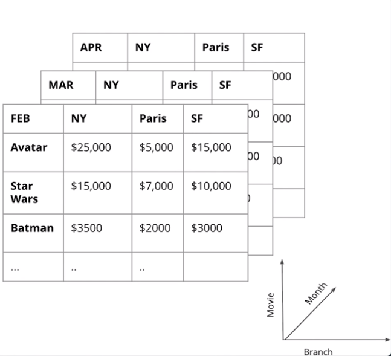
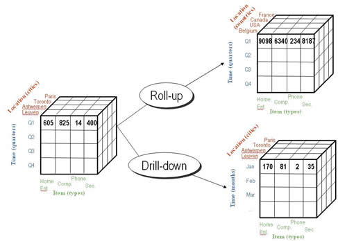
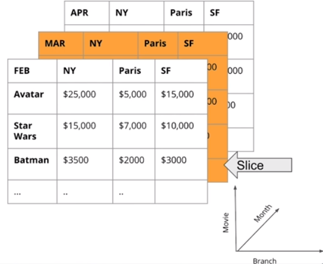
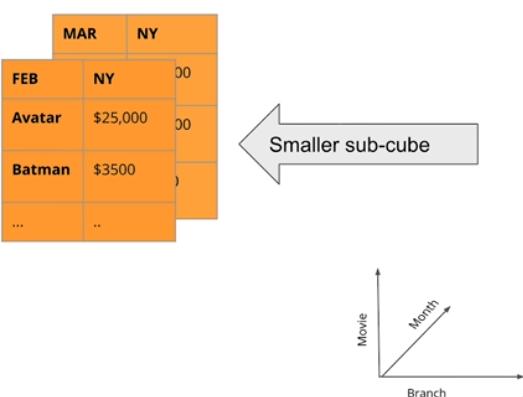

## OLAP Cubes

OLAP Cubes are multidimensional arrays that describe fact metrics in multiple dimensions.



Common OLAP operations are the following:

- **Roll up**: Aggregate or summarizing the data along a dimension. Aggregation functions that can be determined from the cells are known as decomposable aggregation functions, and allow efficient computation, while there are others that must be computed from the base data. For example, it is easy to support COUNT, MAX, MIN, and SUM in OLAP, since these can be computed for each cell of the OLAP cube and then rolled up, since on overall sum (or count etc.) is the sum of sub-sums, but it is difficult to support MEDIAN, as that must be computed for every view separately: the median of a set is not the median of medians of subsets. *E.g. Sum up the sales of cities by Country*

- **Drip down**: Disaggrate hierarchy. Allows the user to navigate among levels of data ranging from the most summarized (up) to the most detailed (down). This means displaying Child Members associated with a specific Parent Member or Aggregate Member within a defined Hierarchy. *E.g. Decompose sales of each city into their districts.*



- **Slice**: is the act of picking a rectangular subset of a cube by choosing a single value for one of its dimensions, creating a new cube with one fewer dimension (where equal clauses). *E.g. Pick the sales of February*  



- **Dice**: is the act of restricting a particular set of a dimension (where in clauses).  *E.g. Pick the sales of in Febraury or March*




### Grouping Set or Cube

OLAP Cube allow grouping sets. The GROUPING SETS clause is an extension to the GROUP BY clause of a SELECT statement that allows you to group your results multiple ways, without having to use multiple SELECT statements to do so. This means you can reduce response time and improve performance. 

The following query

```sql

--month, country totals + month totals + country totals + overall total
SELECT d.month, c.country, sum(s.sales_amount) revenue
FROM factsales s
left join dimcustomer c
on s.customer_key = c.customer_key
left join dimdate d
on s.date_key = d.date_key
where country in ('United States', 'Canada')
group by grouping sets ((), (d.month), (c.country), (d.month, c.country));
```

or 

```sql

--month, country totals + month totals + country totals + overall total
SELECT d.month, c.country, sum(s.sales_amount) revenue
FROM factsales s
left join dimcustomer c
on s.customer_key = c.customer_key
left join dimdate d
on s.date_key = d.date_key
where country in ('United States', 'Canada')
group by cube(d.month, c.country);
-- Cube(d.month, c.country) = grouping sets ((), (d.month), (c.country), (d.month, c.country))
-- Watch out! Ensure you don't have values Nones before execute grouping sets or cubes, otherwise overall metrics will be confused with None values
```  

both display faster and together the same information than the following three queries:  

```sql

--month, country totals
SELECT d.month, c.country, sum(s.sales_amount) revenue
FROM factsales s
left join dimcustomer c
on s.customer_key = c.customer_key
left join dimdate d
on s.date_key = d.date_key
where country in ('United States', 'Canada')
group by month, country
order by country;

--month totals
SELECT month, sum(sales_amount) revenue
FROM factsales s
left join dimdate d
on s.date_key = d.date_key
group by month;

--country totals
SELECT country, sum(sales_amount) revenue
FROM factsales s
left join dimcustomer c
on s.customer_key = c.customer_key
where country in ('United States', 'Canada')
group by country;

--overall total
SELECT sum(sales_amount) revenue
FROM factsales;
```

or all together what is the following:

```sql
--month, country totals + month totals + country totals + overall total
SELECT  NULL as month, NULL as country, sum(sales_amount) as revenue
FROM factSales
    UNION all 
SELECT NULL, dimStore.country,sum(sales_amount) as revenue
FROM factSales
JOIN dimStore on (dimStore.store_key = factSales.store_key)
GROUP by  dimStore.country
    UNION all 
SELECT cast(dimDate.month as text) , NULL, sum(sales_amount) as revenue
FROM factSales
JOIN dimDate on (dimDate.date_key = factSales.date_key)
GROUP by dimDate.month
    UNION all
SELECT cast(dimDate.month as text),dimStore.country,sum(sales_amount) as revenue
FROM factSales
JOIN dimDate     on (dimDate.date_key         = factSales.date_key)
JOIN dimStore on (dimStore.store_key = factSales.store_key)
GROUP by (dimDate.month, dimStore.country)
```

## How do we serve OLAP Cubes?

- **Approach 1**: OLAP Cubes are served in a **non-realtional database (MOLAP)**, having pre-aggregate OLAP cubes on special purposes avaiable to users.
- **Approach 2**: OLAP Cubes are served in a **relational database (ROLAP)**, computing aggregation on the fly.

## Row-oriented vs Column-oriented DBMS

A relational database management system provides data that represents a two-dimensional table, of columns and rows. It means we could store data across columns or across rows. So, which orientation is better?  

Comparisons between row-oriented and column-oriented databases are typically **concerned with the efficiency of hard-disk access** for a given workload. The faster we are able to access the data we want the better. However, there is not a single solution for everything. 

In practice, **columnar databases are well-suited for OLAP-like workloads** (e.g., data warehouses) which typically involve highly complex queries over all data (possibly petabytes). However, some work must be done to write data into a columnar database. Transactions (INSERTs) must be separated into columns and compressed as they are stored, making it less suited for OLTP workloads. 

On the other hand, **Row-oriented databases are well-suited for OLTP-like workloads** which are more heavily loaded with interactive transactions. For example, retrieving all data from a single row is more efficient when that data is located in a single location (minimizing disk seeks), as in row-oriented architectures. 

Recently, most of column-oriented systems have been developed as hybrids capable of both OLTP and OLAP operations, with some of the OLTP constraints column-oriented systems face mediated using (amongst other qualities) in-memory data storage. Column-oriented systems suitable for both OLAP and OLTP roles effectively reduce the total data footprint by removing the need for separate systems.

