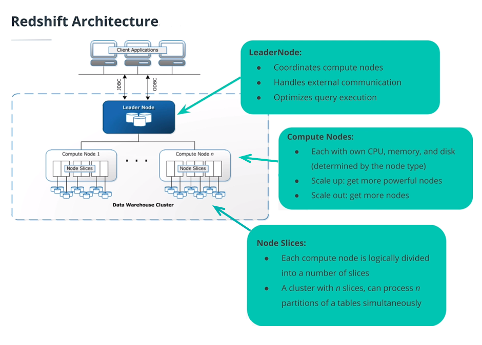
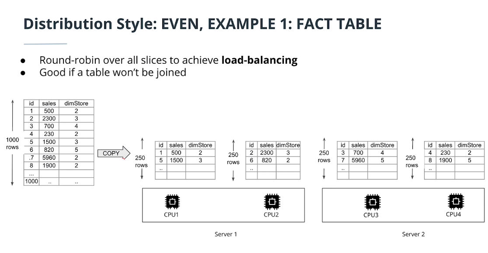
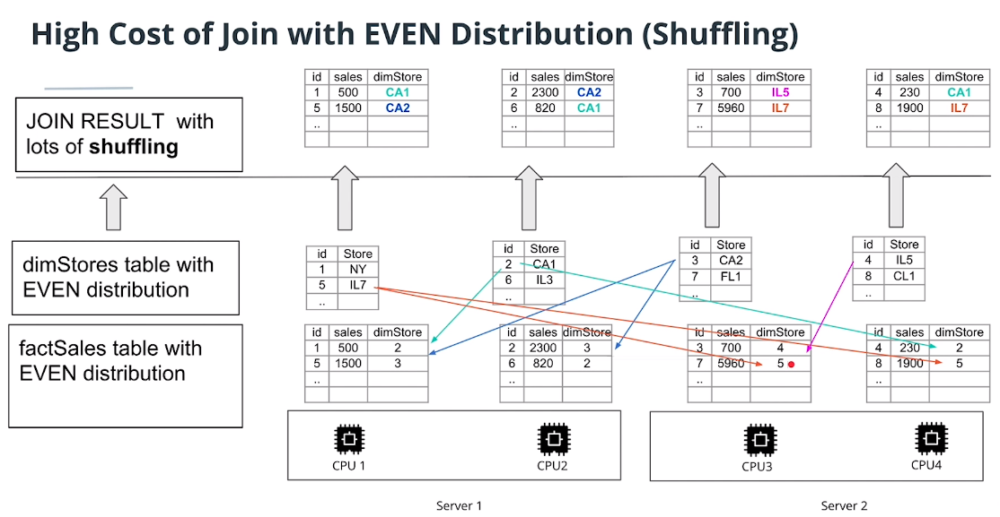
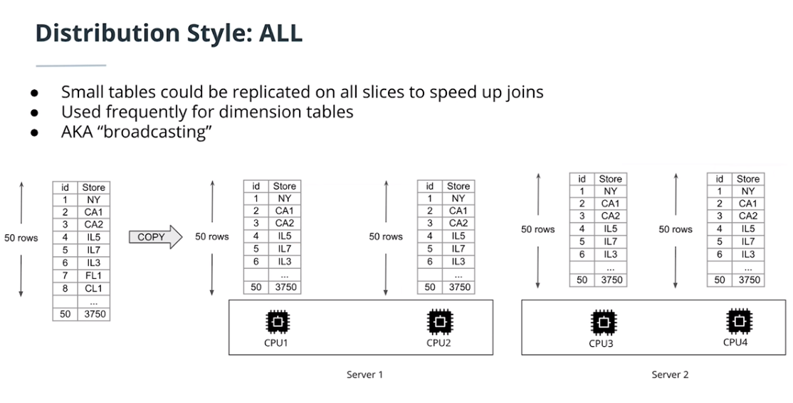
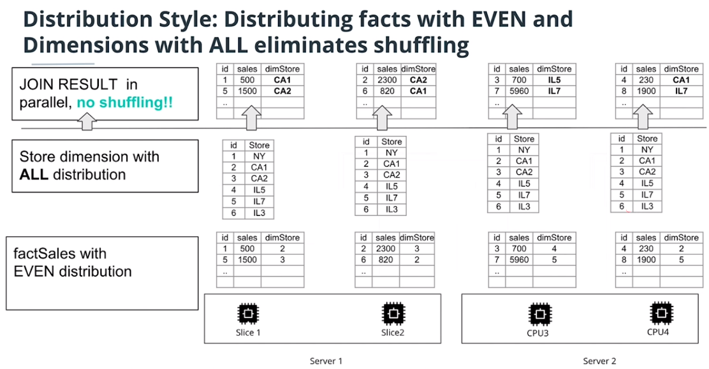
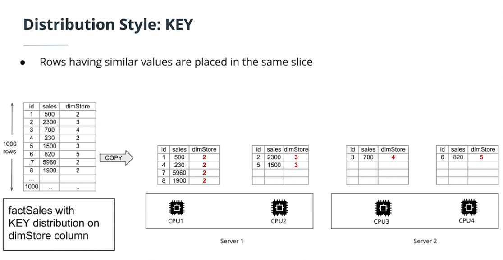
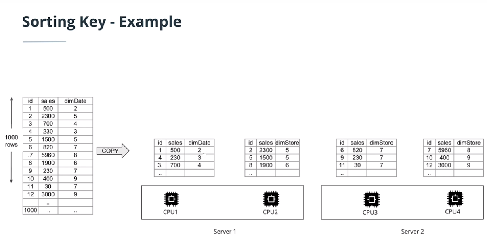

# Cloud Data Warehouses in AWS

In this chapter, you'll go into the cloud infrastructure ecosystem and understand how to use essential tools for computing, storage, and analytics through one of the biggest providers of cloud computing, Amazon Web Services. You will be able to implement a Data Warehouse in AWS, including scalable storage, ETL strategies and query optimization. 

## What is Cloud Computing?

Cloud Computing consist on **using remote servers to store, manage and process data** instead of using local servers or personal computer.

The main advantatges of cloud compunting are the following:

- Eliminate need to invest in hardware upfront and **avoid mantaining costs**. No need to worry about whether you are paying for more than you'll need, because you pay as much as you use. However, it doesn't mean that Cloud is allways cheaper, it depends on the case. Imagine comparing between to rent an apartment or buy it.  
- **Rapidly provision and flexibility in resources**. No need to care about what to do if you need to scale a lot more later on. Cloud services provides make this task as easy as clicking a few buttons to scale your resources up or down.  
- **Provide efficent global access**. You can provide efficient access to your applications around the world by spreading your deployments to multiple regions.  

## Cloud-managed vs Self-managed Cloud Data Warehouse

Once we decide to store our data in cloud using a Cloud Data Warehouse, we have two options to manage the Data Warehouse: Cloud-management or Self-management.

**Cloud-managed** means that to re-use the expertise of the provider (AWS, Azure, etc.), using their database services. The main advantatge is having to care less in IT Staff, security, upgrades, OpEx etc. Another advantage is that we have infrastructure as code waht means we can script the resources we need. 
The downside is that we lose a little bit of control because settings are preconfiugured for us on settings.  

On the other hand, if we need really advanced requirements we can take the **Self-Managed** path which is a "catch-all" option.  

# AWS Redshift 

Once we decide to store our data in Cloud and use a **cloud-managed** service, we have several options depending on our technical needs. From SQL to any kind of NoSQL databases. Regarding SQL the main databases are RDS and Amazon Redshift, being Amazon Redshift probably the most common because of being **column oriented** and **massively parallel**, meaning good performance for OLAP purposes. 

*AWS is not the only provider of a service with such characteristics. Other examples include Azure SQL, Aster Teradata or Oracle ExaData.*

## AWS Redshift Architecture

Amazon Redshift architecture is a cluster that consists on a single Leader Node, which coordinate compute nodes, and several compute node divided in n slices, that can process n tables partitions. 

  

- The total number of **nodes** in a Redshift cluster is equal to the number of **EC2 instances** used in your cluster. 
- Each **slice** in a Redshift cluster is at least 1 **CPU** with dedicated storage and memory for the slice. 
- The total number of slices in a cluster is our unit of parallelism and it is equal to the sum of all slices on the cluster. I.e. If we have a Redshift cluster with 4 nodes, each containing 8 slices, i.e. the cluster collectively offers 32 slices means that the maximum number of partitions per table is 32.    
  
If you go to AWS webpage you will find many options that you can consider depending on your technical needs.  

  

## ETL in AWS

### SQL to SQL ETL

A common example of ETL in AWS is the SQL to SQL. Imagine you have a Data Source in Amazon RDS and you want to build a Database in Amazon Redshift to do the analytics stuff. 

The recommended process is to build an ETL that extracts data from RDS, save data in S3 as a staging data storage (e.g. in .csv files) and then read data to load it in Amazon Redshift, running all this process in EC2. 

You may think to avoid the S3 step and store data directly in EC2, but although EC2 has some disk memory it is not recommended to use it to store data. The ETL process require a lot of storage, so usually you will want to use S3 as a staging area. However, for very small data, you might want to copy it directly from the EC2 machine.

### AWS ETL: The big picture

Imagine we have many Data Sources, which some of them store data in files in S3, oher in Relational Databases, other in No SQL and even some of them are stored in EC2 machines. This data is very hard to analyse for the analytics team, so we decide to build a Data Warehouse in Amazon Redshift. 

In order to bring data from Data Source to Redshift we need an ETL. Amazon EC2 will run this ETL, that could be orchestrated with Apache Airflow, Luigi or AWS DataPipeline. The ETL will extract the data from SQL, staging it in S3 and then loading it into Amazon Redshift.

Often, people ask why data staging (S3) is needed in ETL processes. ETL Servers talk to different databases and need to store data as it moves it from one place to the next. Using S3 as staging step we allow store transformed data, temporal data, logs of the process and back up data if needed.   

S3 offers a very reliable, scalable and worry-free storage solution, but it only offers storage not processing power. On the other hand, the purpose of the EC2 instance is act as the machine that just get data from a source or database transform it and load it into another database, while their storage capacities are more limited.

When ingesting data in Amazon Redwshift, one important tip is prevent from inserting record by record, what is really slow. A much better option is bulk insertion by COPY command.

Furthermore, another best practice is to split a table into multiple files before ingestion. Each Redshift slice will act as a separate worker and will use ingest the split of a file in parallel, so the process will complete much faster.

However, in many cases Amazon Redshift won't be enough to do BI stuff. Scalability issues will do that we need data pre-aggregated to be able to run fast visualizations. 

## Table Design in Redshift 

As you plan your database, certain key table design decisions heavily influence overall **query performanc**e. These design choices also have a significant effect on storage requirements, which in turn affects query performance by reducing the number of I/O operations and minimizing the memory required to process queries.

In this section, you can find a summary of the most important design decisions and presents best practices for optimizing query performance. Designing Tables provides more detailed explanations and examples of table design options.

### Choose the Best Distribution Style

When you execute a query, the query optimizer redistributes the rows to the compute nodes as needed to perform any joins and aggregations. The goal in selecting a table distribution style is to minimize the impact of the redistribution step by locating the data where it needs to be before the query is executed.

Amazon Redshift offer 4 ways of distribute your Tables, which are the following:

- **Even Distribution**: Round-robin over all slices to achieve load-balancing. Every table is splitted row-wise through row index, having row-wise slices of tabes in each CPU node. Thus, a table is partitioned on slices such that each slice have an almost equal number of records from the partitioned table. This option is good whether you won't join tables because joining table will be slow given that Redshift should merge tables from diferent tables every time you ask for joining result.

- **All or Broadcasting Distribution**: Small tables (dimension tables) are replicated on all slices (CPU) to speed up joins. This way the need of shuffling tables in every join is avoided and the performance is better. On the other hand, we need much more disk size. It is a good option when dimension tables are small.

- **Auto Distribution**: Allows Redshift to determine distribution style. Redshift choose itself between even or all distribution depending on the size of the dimension tables. This is the default option. To let Amazon Redshift choose the appropriate distribution style, don't specify DISTSTYLE.

- **Key Distribution**: Consist on partitioning by groups of dimensions.  Rows having similar values are placed in the same slice. This method distribute the fact table and one dimension table on their common columns.

### Choose a Sort Key

Some good practices are:
- If you do frequent range filtering or equality filtering on one column, specify that column as the sort key.
- If recent data is queried most frequently, specify the timestamp column as the leading column for the sort key.
- If you frequently join a table, specify the join column as both the sort key and the distribution key.

### Other best practices

Other [important tips and best practices](https://docs.aws.amazon.com/redshift/latest/dg/c_designing-tables-best-practices.html) had to be considered when desinging tables in Redshift. 

- Let COPY Choose Compression Encodings
- Define Primary Key and Foreign Key Constraints
- Use the Smallest Possible Column Size
- Use Date/Time Data Types for Date Columns
