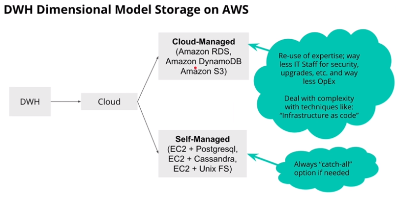
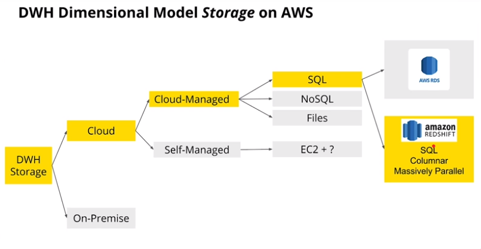
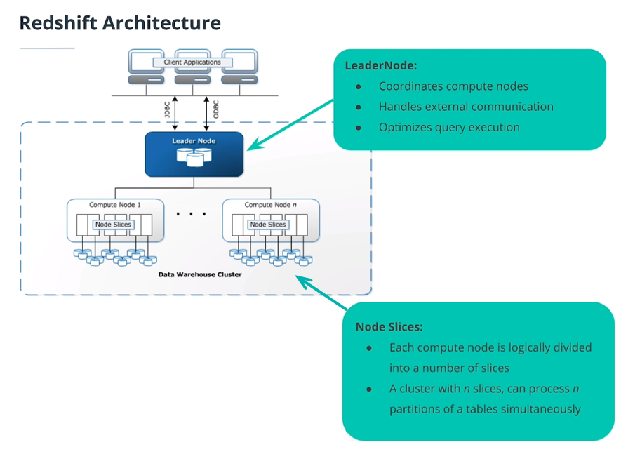
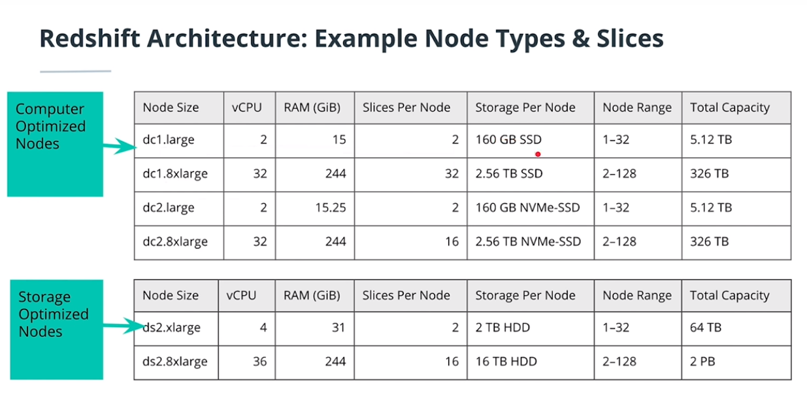
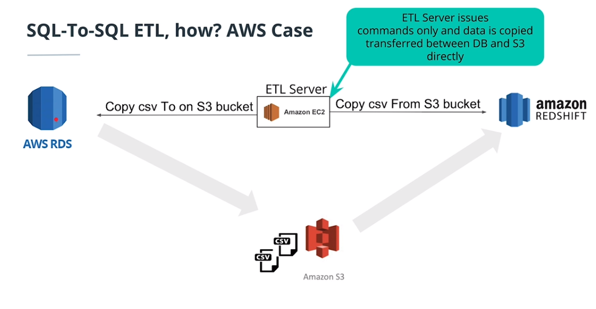
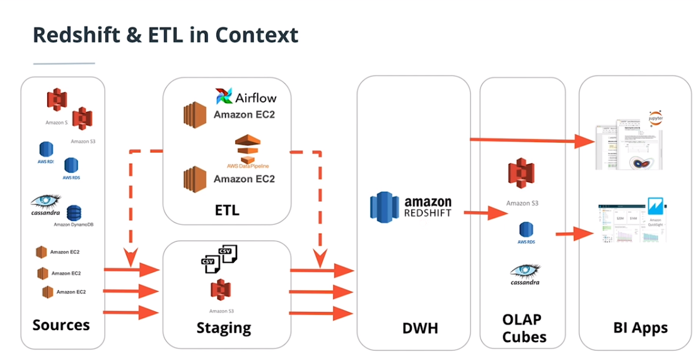

# Cloud Data Warehouses

In this chapter, you'll go into the cloud infrastructure ecosystem and understand how to use essential tools for computing, storage, and analytics through one of the biggest providers of cloud computing, Amazon Web Services. You will be able to implement a Data Warehouse in AWS, including scalable storage, ETL strategies and query optimization. 

## What is Cloud Computing?

Cloud Computing consist on **using remote servers to store, manage and process data** instead of using local servers or personal computer.

The main advantatges of cloud compunting are the following:

- Eliminate need to invest in hardware upfront and avoid their mantaining costs. No need to worry about whether you are paying for more than you'll need, because you pay as much as you use. However, it doesn't mean that Cloud is allways cheaper, it depends on the case. Imagine comparing between to rent an apartment or buy it.  
- Rapidly provision and flexibility in resources. No need to care about what to do if you need to scale a lot more later on. Cloud services provides make this task as easy as clicking a few buttons to scale your resources up or down.  
- Provide efficent global access. You can provide efficient access to your applications around the world by spreading your deployments to multiple regions.  

## Cloud-managed vs Self-managed Cloud Data Warehouse

Once we decide to store our data in cloud using a Cloud Data Warehouse, we have two options to manage the Data Warehouse: Cloud-management or Self-management.

**Cloud-managed** means that to re-use the expertise of the provider (AWS, Azure, etc.), using their database services. The main advantatge is having to care less in IT Staff, security, upgrades, OpEx etc. Another advantage is that we have infrastructure as code waht means we can script the resources we need. 
The downside is that we lose a little bit of control because settings are preconfiugured for us on settings.  

On the other hand, if we need really advanced requirements we can take the **Self-Managed** path which is a "catch-all" option.  

## AWS Redshift 

Once we decide to store our data in Cloud and use a **cloud-managed** service, we have several options depending on our technical needs. From SQL to any kind of NoSQL databases. Regarding SQL the main databases are RDS and Amazon Redshift, being Amazon Redshift probably the most common because of being **column oriented** and **massively parallel**, meaning good performance for OLAP purposes. 

*AWS is not the only provider of a service with such characteristics. Other examples include Azure SQL, Aster Teradata or Oracle ExaData.*

### AWS Redshift Architecture

Amazon Redshift architecture is a cluster that consists on a single Leader Node, which coordinate compute nodes, and several compute node divided in n slices, that can process n tables partitions.

If you go to AWS webpage you will find many options that you can consider depending on your technical needs.

## ETL in AWS

### SQL to SQL ETL

A common example of ETL in AWS is the SQL to SQL. Imagine you have a Data Source in Amazon RDS and you want to build a Database in Amazon Redshift to do the analytics stuff. 

The recommended process is to build an ETL that extracts data from RDS, save data in S3 as a staging data storage (e.g. in .csv files) and then read data to load it in Amazon Redshift, running all this process in EC2. 

You may think to avoid the S3 step and store data directly in EC2, but although EC2 has some disk memory it is not recommended to use it to store data. The ETL process require a lot of storage, so usually you will want to use S3 as a staging area. However, for very small data, you might want to copy it directly from the EC2 machine.

### AWS ETL: The big picture

The following is an example of ETL process, showing the picture from Data Source to ETL. 

Imagine we have many Data Sources, which some of them store data in files in S3, oher in Relational Databases, other in No SQL and even some of them are stored in EC2 machines. This data is very hard to analyse for the nalytics team, so we decide to build a Data Warehouse in Amazon Redshift. 

To bring data from Data Source to Redshift we need an ETL. Amazon EC2 will run this ETL, that could be orchestrated with Apache Airflow, Luigi or AWS DataPipeline. The ETL will extract the data from SQL, staging it in S3 and then loading it into Amazon Redshift.

However, in many cases Amazon Redshift won't be enough to do BI stuff. Scalability issues will do that we need data pre-aggregated to be able to run fast visualizations.

# Hands on Amazon Redshift 

### Create an IAM Role

An AWS IAM (Identity and Access Management) is a framework for business processes that facilitates the management of electronic or digital identities. 

For any operation that accesses data on another AWS resource, your cluster needs permission to access the resource and the data on the resource on your behalf. You provide those permissions by using AWS Identity and Access Management (IAM).

To create an IAM Role follow the [steps in AWS tutorial](https://docs.aws.amazon.com/redshift/latest/gsg/rs-gsg-create-an-iam-role.html).

### Create Security Group

