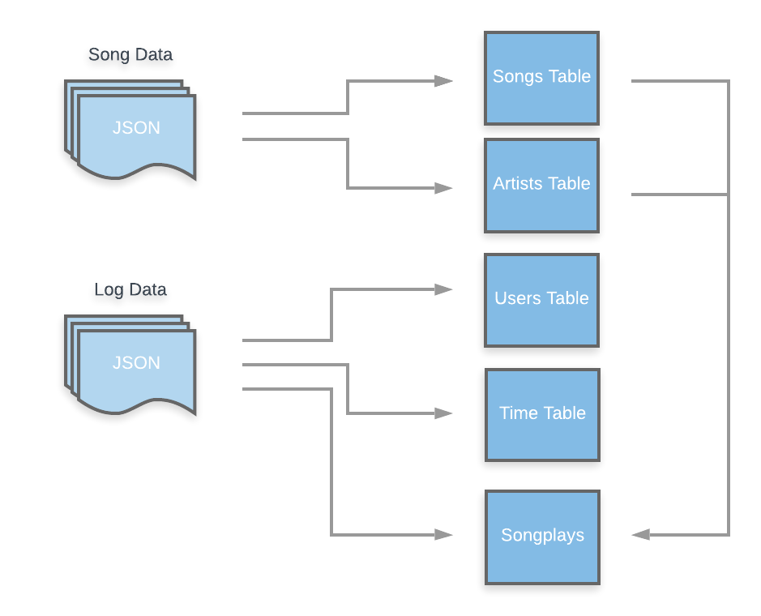

## Project 1 - Data Modelling with PostreSQL

### Motivation

The aim of this project is to create a relational database for the Sparkify, a new music streaming startup, who wants to collect their songs and user activity in a database for analysis purposes. Before this project, they data resided in a directory of JSON logs and they didn't have an easy way to query their data. After creating a PostgreSQL database schema and providing a simple ETL pipeline that transfers data from files in two local directories to the database, Sparkify are able to easily query and analyse their data.

### Database Schema for Song Play Analysis

Firstly, a star schema has been created (Figure 1). A star schema simplifies queries for analysis, enable fast aggregations and optimize performance for queries on song play analysis (denormalized), which were the main purposes of Sparkify. 

The star schema created for Sparkify includes the following tables:

- Fact Table: 
    - songplays - records in log data associated with song plays
- Dimension Tables: 
    - users - users in the app
    - songs - songs in music database
    - artists - artists in music database
    - time - timestamps of records in songplays broken down into specific units
    


While fact table songplays provides the metric of the business process (How many songs has been played?), dimension tables provide additional information (who, what and where).

Notice that each identifier of dimesion tables has been declared as a Primary Key. Also the composite key (user_id, start_time) of songplays has been declared, since these two attributes define a unique value for song plays.

### ETL

Having created the schema, an ETL to transfer data from JSON files to the new database is needed. 


The Sparkify json files consist of two datasets: 
- Song files - contains metadata about a song and the artist of that song
- Log files - contains user activity logs 

Using pandas and the psycopg2 driver, song and log files have been readed, transformed and loaded into the previous PostgreSQL tables (songplays, users, songs, artists and time) as the following process:



Both songs and artists are easily extracted from song json files and both users and time from log files. However, the extraction of songplays (the fact table) is a little bit more tricky, since their attributes song_id and artist_id have been obtained not only from log files, but also using song and artist tables.

### Analysing Sparkfy Database

Given that the analytics team is particularly interested in understanding user behavior, an example of a query is provided as a demonstration of the ease to analyze Sparkify's data thanks to the new star schema.

Concretely, the following is an example, show the top 5 users who listen to more songs:

```sql
SELECT user_id, count(distinct songplay_id) FROM songplays group by user_id order by count(distinct songplay_id) desc LIMIT 5;
```
