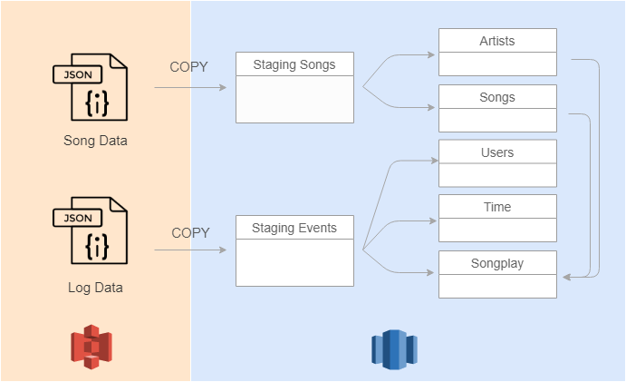

# Project: Data Warehouses

In this project, we build an ETL pipeline for a database hosted on Redshift. To do it, we load data from **S3** to staging tables on **Redshift** and execute SQL statements that create the analytics tables (also in Redshift) from these staging tables.

Data sources reside in two public S3 buckets:

- Song data: s3://udacity-dend/song_data
- Log data: s3://udacity-dend/log_data

Song bucket contains information about songs and artists and log bucket contains data about actions done by users. The objects contained in both buckets 
are JSON files. However, the song bucket has all the files partitioned by the first three letters of each song's track ID, while log files are partitioned by year and month

### Files

The project template includes four files:

- **create_table.py** - Create fact and dimension tables for the star schema in Redshift.
- **etl.py** - Data is loaded from S3 into staging tables on Redshift and then it is processed into your analytics tables on Redshift.
- **sql_queries.py** - Define SQL statements, which will be imported into the two other files above.
- **dhw.cfg** - Configuration file used that contains info about Redshift, IAM and S3

### Data Model

A star schema optimized for queries on song play analysis has been created. This includes the following tables:

**Fact Table**
- songplays - records in event data associated with song plays i.e. records with page NextSong  
    *songplay_id, start_time, user_id, level, song_id, artist_id, session_id, location, user_agent*

**Dimension Tables**
- users - users in the app  
    *user_id, first_name, last_name, gender, level*
- songs - songs in music database  
    *song_id, title, artist_id, year, duration*
- artists - artists in music database  
    *artist_id, name, location, lattitude, longitude*
- time - timestamps of records in songplays broken down into specific units  
    *start_time, hour, day, week, month, year, weekday*

### ETL Process

The following is the arquitecture schema of the project:

To create staging tables, the COPY command we will access to the JSON files inside the buckets and copy their content on our staging tables. 

###  How to run

1. Create a Redshift Cluster and write your config information in dwh.cfg. In this example a Redshift dc2.large cluster with 4 nodes has been created, with a cost of USD 0.25/h (on-demand option) per cluster.
2. Execute create_tables.py. It will create every table of the schema designed.
3. Eexecute etl.py. It will run the full ETL process, loading data from buckets into staging tables and creating the final tables in Amazon Redshift.
